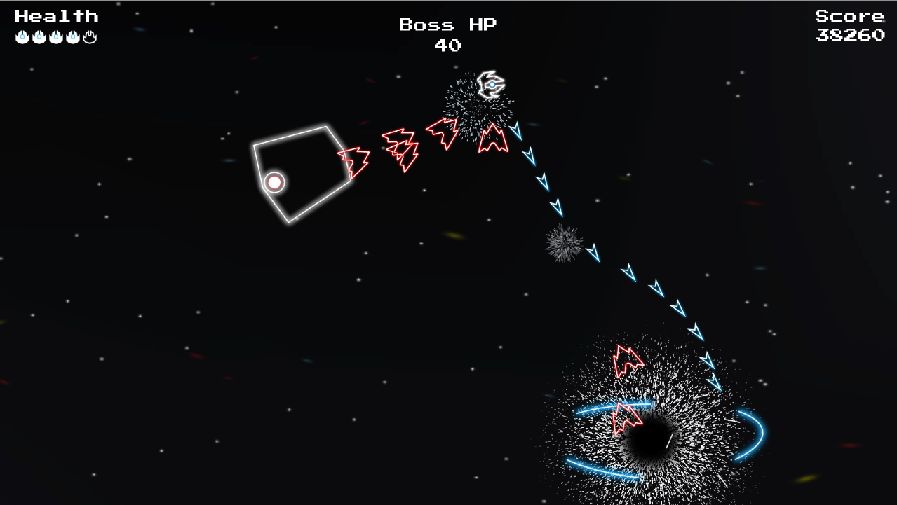

# SUPER POLYSPAWN WARS  
Space Shooter Game created and written entirely in Unity and C#.  
Throwback to classic arcade-style space shooters.  

Play it LIVE [here](http://kimbrosinc.com/projects/super_polyspawn_wars/)  
Note: WebGL is not fully supported on some browsers. It works best on Chrome, Firefox or Edge.  

## REQUIREMENTS FOR DESKTOP PLAY:  
* [Unity Game Engine](https://unity3d.com/)  
* Download Source Code here, then Run or Build the project in Unity.  

## IMPLEMENTATION:  
* Uses trigonometry to calculate rotations and angles for player ship, enemies and lasers.  
* All objects in game are set as prefabs.  
* Background has parallax effect based on player's movement.  
* Coroutines for enemy movement, spawning, powerup generation, and powerup effects.  
* Dependent on time rather than framerate to account for different game quality framerates. (meters per second rather than meters per frame)

## FEATURES:
* Powerups (speed boost, triple shot, shield, health)
* Pause or Quit game
* Temporary Invincibility when hit
* Score and Grade system
* Increase in difficulty as player progresses
* Unique bosses and attack patterns  
* 60 FPS animations  

## CREDITS:  
* Art and Animations: Isaac Kim  
* Game Engine: [Unity](https://unity3d.com/)
* Sounds: [JFXR](https://jfxr.frozenfractal.com)
* Music: [Erik Skiff](http://ericskiff.com/music/)
  * All of Us
  * Arpanauts
  * Digital Native
